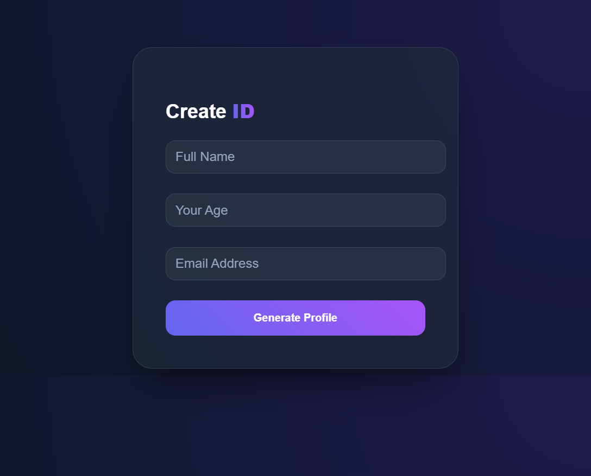
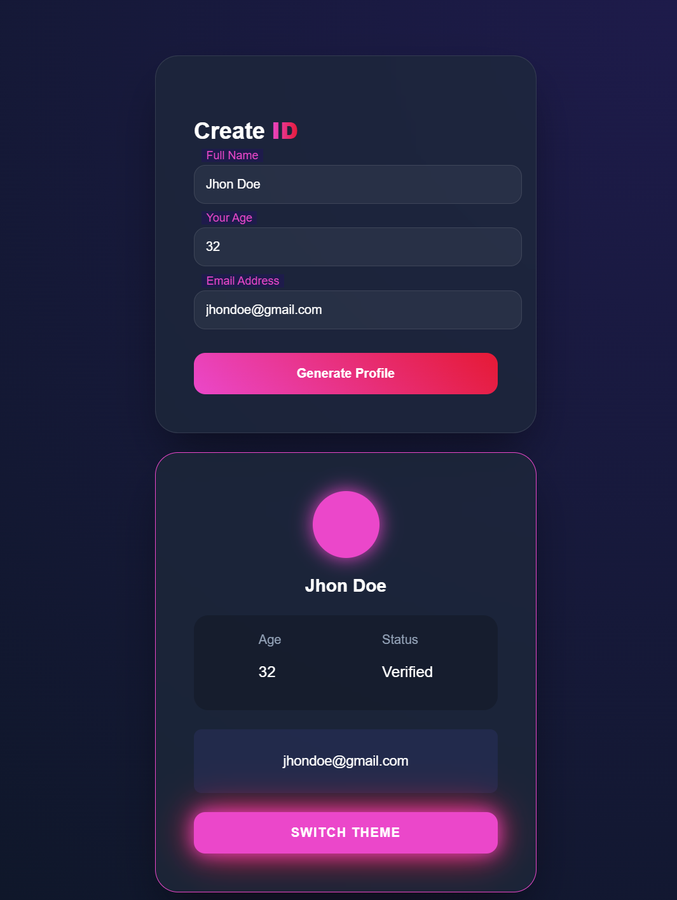
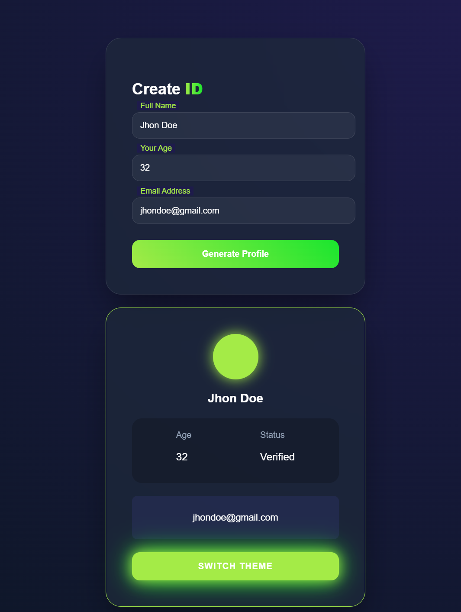
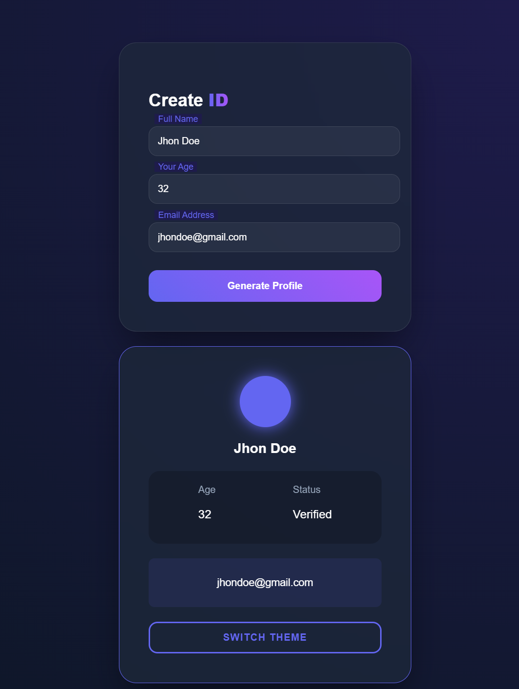
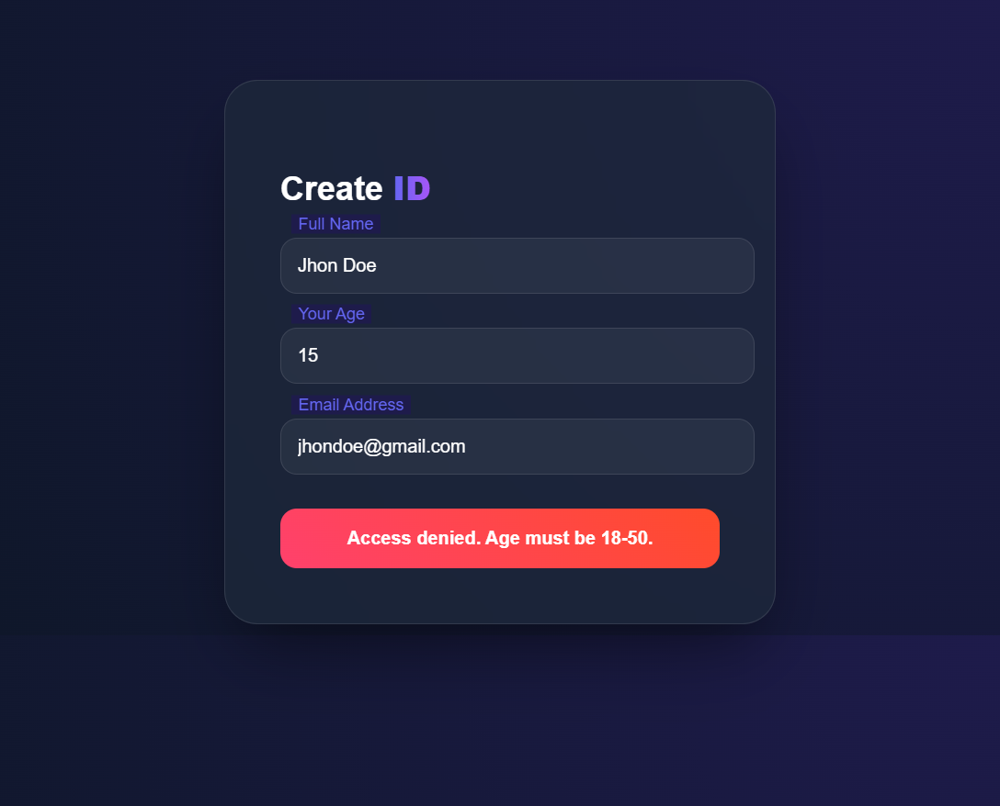

# 🪪 User Info Card System (Premium UI/UX)

A  **User Data Management Interface** that transforms boring form inputs into a stunning, animated Profile Card. Built with a focus on **Interactive Design** and **Real-time Theming**.

## 🌟 Project Overview
This project is more than just a form; it's an exploration of modern frontend capabilities. It takes user input (Name, Age, Email), validates it against global standards, and generates a futuristic Identity Card with smooth transitions.

## 🚀 Technical Highlights
* **🔮 Glassmorphism UI:** Utilizing `backdrop-filter: blur` and semi-transparent layers for a modern aesthetic.
* **🎭 Dynamic Card Generation:** JavaScript logic that handles data parsing and triggers CSS animations.
* **🌈 Global Theme Switcher:** Uses CSS Variables (`--primary`) to change the entire site's color palette with one click.
* **🛑 Logic-Based Validation:** * Name validation (Alphabets only).
    * Email pattern matching.
    * Age constraints (18-50 years).
* **✨ Interaction Design:** Custom fireball cursor tracking and floating labels for a "no-click" intuitive feel.

## 🛠️ Built With
* **HTML5:** Semantic structure.
* **CSS3:** Custom properties, Flexbox, and Keyframe animations.
* **JavaScript (ES6):** DOM manipulation, Event listeners, and Regex.

## 📂 File Structure
- `index.html` - The core structure and layout.
- `style.css` - Custom styling and theme engine.
- `JS.js` - Validation logic and interaction handling.

## 💡 Why this Project?
As a Software Engineering student, I developed this to demonstrate:
1. **Clean Code:** Separation of concerns between Logic and Styling.
2. **User Centricity:** Making data entry engaging and error-proof.
3. **Scalability:** Easily adaptable for CRM or Dashboard onboarding.

---
Developed by **Zain** | *Software Engineering Student & Frontend Enthusiast*
